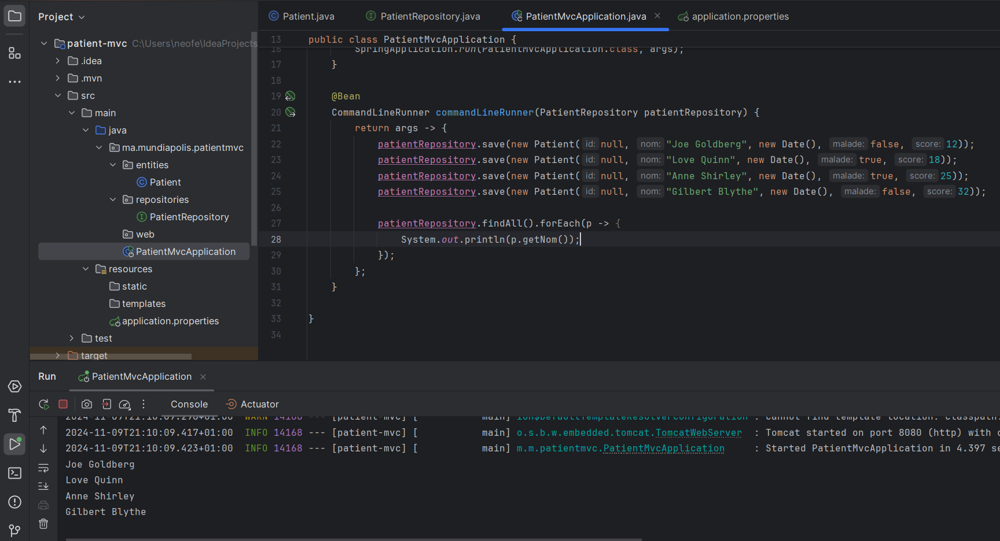
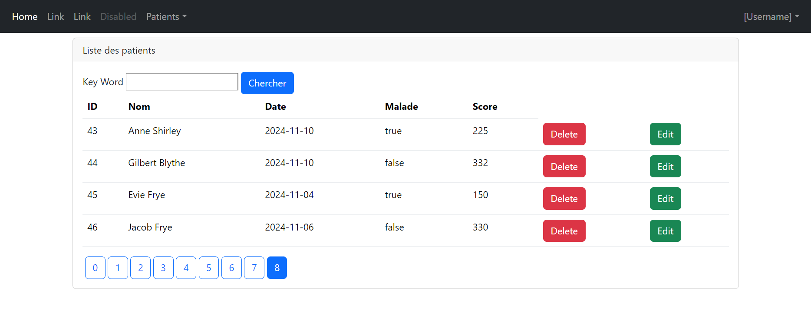

<h1>Compte rendu du TP N°3 - Spring MVC - Gestion des patients</h1>
<h2>Exécution du Bean</h2>

<h2>Affichage des patients</h2>
<h3>NavBar page courante</h3>

<h3>Recherche par Keyword</h3>

<h2>Supprimer un patient</h2>
</img>
<h2>Ajout du menu</h2>
</img>
<h2>Formulaire pour ajouter un patient</h2>
<h3>Ajout du patient "Edward Elric"</h3>
</img>
</img>
<h3>Error Handling du formulaire</h3>
</img>
<h2>Modifier un patient</h2>
</img>
<h3>Modification du score du patient ID = 43</h3>
</img>
</img>

